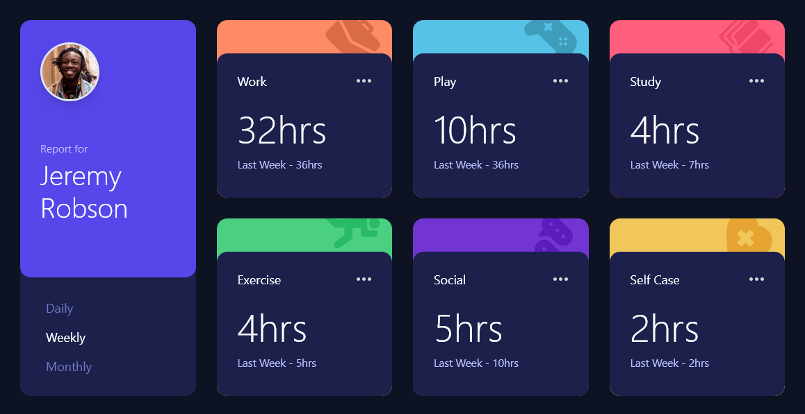

# Frontend Mentor - Time tracking dashboard solution

This is a solution to the [Time tracking dashboard](https://www.frontendmentor.io/challenges/time-tracking-dashboard-UIQ7167Jw). Frontend Mentor challenges help you improve your coding skills by building realistic projects.

## Table of contents

- [Frontend Mentor - Time tracking dashboard solution](#frontend-mentor---time-tracking-dashboard-solution)
  - [Table of contents](#table-of-contents)
  - [Overview](#overview)
    - [The challenge](#the-challenge)
    - [Screenshot](#screenshot)
    - [Links](#links)
  - [My process](#my-process)
    - [Built with](#built-with)
    - [What I learned](#what-i-learned)
    - [Useful resources](#useful-resources)
  - [Author](#author)
  - [To do](#to-do)

## Overview

### The challenge

Users should be able to:

Your challenge is to build out this dashboard and get it looking as close to the design as possible.

You can use any tools you like to help you complete the challenge. So if you've got something you'd like to practice, feel free to give it a go.

Your users should be able to:

- View the optimal layout for the site depending on their device's screen size
- See hover states for all interactive elements on the page
- Switch between viewing Daily, Weekly, and Monthly stats

Want some support on the challenge? [Join our community](https://www.frontendmentor.io/community) and ask questions in the **#help** channel.

### Screenshot

### Links

- Solution URL: [Github repo](https://github.com/luAr26/time-tracking-dashboard)
- Live Site URL: [Live Demo](https://time-tracking-dashboard-two-snowy.vercel.app/)

## My process

### Built with

- Semantic HTML5 markup
- CSS variables
- Grid
- Mobile-first workflow
- [Next.js](https://nextjs.org/) - React framework
- [Tailwind](https://tailwindcss.com/) - For styles

### What I learned

I got to practice CSS Grid.

[CSS Grid](https://tailwindcss.com/docs/grid-template-columns)

### Useful resources

- [Tailwind CSS Docs](https://tailwindcss.com/docs/installation) - This helped me build the layout and design elements
- [Nextjs Docs](https://nextjs.org/docs) - This helped me build the functionality.

## Author

- Frontend Mentor - [@luAr26](https://www.frontendmentor.io/profile/luAr26)

## To do

- Use the `data.json` file provided by [Front-end Mentor](https://www.frontendmentor.io/challenges/time-tracking-dashboard-UIQ7167Jw)
